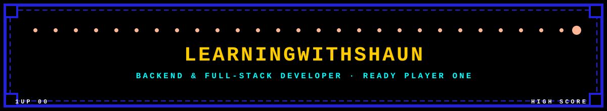

  

---

I'm a passionate Full-Stack Developer and a third-year ICT Application Development student at Cape Peninsula University of Technology (CPUT). I enjoy building scalable web applications, developing secure backend systems, and creating user-friendly interfaces that solve real-world problems.

🚀 **What I'm working on:**

* Building full-stack web applications
* Strengthening my backend development skills
* Exploring cloud technologies, AI, and software architecture
* Contributing to open-source projects

📌 **Projects I'm proud of:**

* **DailyWin** – A full-stack task management application designed to improve productivity.
* **KasiPay** – A digital payment platform built during a hackathon.
* **PavelPayments** – A micropayments UI on Interledger Open Payments.
* **LearnHub** – A desktop application that helps university students discover study groups.

🌱 I'm always learning, building, and looking for opportunities to collaborate on impactful software projects.

📫 Feel free to explore my repositories and connect with me!

---

### 🛠️ Recent Builds

| Project | What it is | Stack |
|---|---|---|
| 🌊 **KeepITBlue** | Nonprofit site for ocean conservation, homepage redesign + branding | HTML/CSS/JS |
| 💸 **PavelPayments** | Micropayments UI on Interledger Open Payments, dark fintech aesthetic | Web Monetization |
| 🍽️ **YummyCafé** | Mobile-first campus cafeteria ordering app | React |
| 🎧 **Chatizen / Zeni** | AI-powered Spotify music recommendation assistant (UX/UI Engineer) | React |

---

### 💻 Tech Stack

---

### 📊 GitHub Stats

  
  

  

  

---

### 🐍 Contribution Snake

  

> ℹ️ This animated snake needs a one-time GitHub Actions setup on your profile repo — see the [snake action README](https://github.com/Platane/snk) for the ~5-line workflow file. Once added, it auto-generates on a schedule.

---

### 🌐 Let's Connect

  
  

<i>Currently learning to say "it's a simple fix" without lying.</i>

